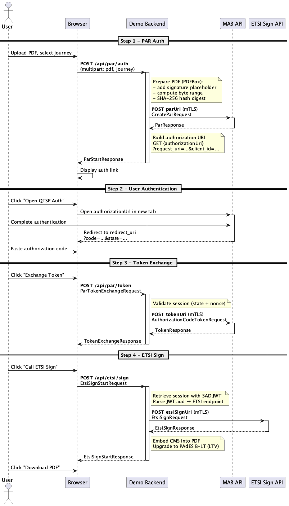
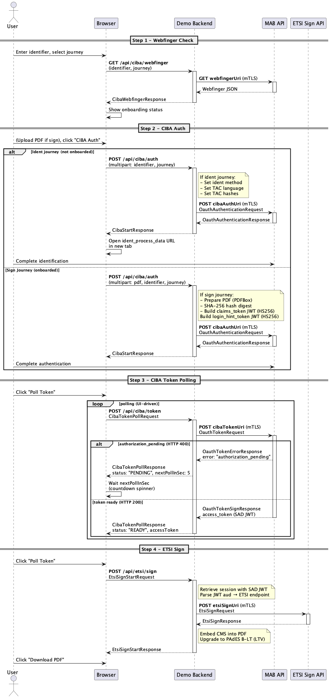

# Demo Signer (MAB + ETSI Sign)

This project is a minimal end-to-end demo that shows how to integrate the Swisscom Trust Services Multiple Authentication Broker (MAB) APIs and the ETSI Sign API.

It is built as a reference implementation for:
- Using mTLS for all protected endpoints 
- Calling OIDC + PAR
- Calling OIDC + CIBA
- Exchanging the authorization code for an access token (SAD JWT)
- Polling CIBA token endpoint for an access token (SAD JWT)
- Calling the ETSI signDoc endpoint to sign a document digest 
- Providing a small browser UI for manual testing (copy/paste auth code)
- Preparing a PDF for signature with PDFBox
- Embedding the returned CMS signature back into the PDF to obtain a final, signed PDF without modifying the signed byte ranges
- Adding PAdES DSS/VRI structures to upgrade the signature to Baseline B-LT (LTV enabled)
- Providing a minimal browser UI for manual testing (copy/paste authorization code flow)

## PAR Flow Sequence Diagram



## CIBA Flow Sequence Diagram



## Tech Stack

- Java 21 
- Spring Boot (WebFlux)
- Project Reactor (Mono / reactive flows)
- Netty HTTP client with mTLS (ReactorClientHttpConnector)
- Apache PDFBox
  - External PDF signing
  - CMS embedding into PDF signature placeholders
  - Incremental update handling
  - Manual construction of PAdES DSS + VRI structures
  - PAdES Baseline B-LT (LTV enabled) support
- OpenAPI-generated clients (MAB + ETSI)
- Static HTML/CSS/JavaScript UI
  - Minimal browser UI for manual end-to-end testing
  - Copy/paste Authorization Code flow

## Prerequisites

To run this demo against Swisscom preprod you need:

- mTLS client certificate + key issued by STS 
- client_id and client_secret issued by STS 
- A configured redirect URL (for this demo, a “copy/paste code” workflow is used)

## Configuration

This project is safe for public repositories and does not contain real secrets.
All values are injected via environment variables.

### application.yml (defaults)

The repository ships with safe defaults like:
- QTSP_CLIENT_ID=00000000-0000-0000-0000-000000000000 
- QTSP_MTLS_BASE_URL=https://example.invalid

These are the exact variable names currently referenced by the app:

- `DISCOVERY_PATH`
- `CLIENT_ID`
- `CLIENT_SECRET`
- `REDIRECT_URI`
- `MTLS_BASE_URL`
- `MTLS_CLIENT_CERT`
- `MTLS_CLIENT_KEY`
- `SPRING_PROFILES_ACTIVE`

They can be set for local development in application-dev.yaml.

### Using a local `.env` file

Create a `.env` file in the project root. You can start from the checked-in example:

```bash
cp .env.example .env
```

Sample `.env`:

```dotenv
DISCOVERY_PATH=https://example.invalid/.well-known/openid-configuration
CLIENT_ID=xxxxxxxx-xxxx-xxxx-xxxx-xxxxxxxxxxxx
CLIENT_SECRET=xxxxxxxx-xxxx-xxxx-xxxx-xxxxxxxxxxxx
REDIRECT_URI=https://webhook.site/<your-id>
MTLS_BASE_URL=https://example.invalid
MTLS_CLIENT_CERT=file:/absolute/path/to/client-cert.pem
MTLS_CLIENT_KEY=file:/absolute/path/to/client-key.pem
SPRING_PROFILES_ACTIVE=dev
```

For `MTLS_CLIENT_CERT` and `MTLS_CLIENT_KEY`, use Spring resource syntax such as `file:/absolute/path/to/client-cert.pem` or `classpath:...`.

### Exported environment variables

If you prefer, you can still export the variables manually before starting the app.
If the same variable is defined in both places, the exported OS environment variable wins over the value from `.env`. This keeps local defaults convenient while preserving the usual ability to override values per shell or CI job.

```bash
export DISCOVERY_PATH="https://example.invalid/.well-known/openid-configuration"

export CLIENT_ID="xxxxxxxx-xxxx-xxxx-xxxx-xxxxxxxxxxxx"
export CLIENT_SECRET="xxxxxxxx-xxxx-xxxx-xxxx-xxxxxxxxxxxx"
export REDIRECT_URI="https://webhook.site/<your-id>"

export MTLS_BASE_URL="https://example.invalid"
export MTLS_CLIENT_CERT="file:/absolute/path/to/client-cert.pem"
export MTLS_CLIENT_KEY="file:/absolute/path/to/client-key.pem"
```

For local development you can also point redirect URI to any endpoint that lets you inspect the URL parameters and copy the code.

## Run the Demo

The project can be built and run with Gradle. If you prefer shorter, more general commands, the project also supports Makefile.

### Gradle

```bash
./gradlew bootRun
```

```bash
./gradlew build
```

### Makefile

```bash
make
```

This runs `./gradlew bootRun` via the project `Makefile`.

If you are using `.env`, no extra export step is required before running that command.

Additional shortcuts:

```bash
make build   # ./gradlew build
make test    # ./gradlew test
make clean   # ./gradlew clean
```

Server starts on:
- http://localhost:8081

Open the UI in a browser:
- http://localhost:8081/

## Security Notes (important)

This demo is designed so it can be published safely:
- No real QTSP credentials are committed
- mTLS key material in the repository is demo-only 
- Tokens are redacted in responses 
- Session state is stored only in-memory (not production-safe)

Do not use this code as production signing software.

Use it as a reference integration blueprint.
